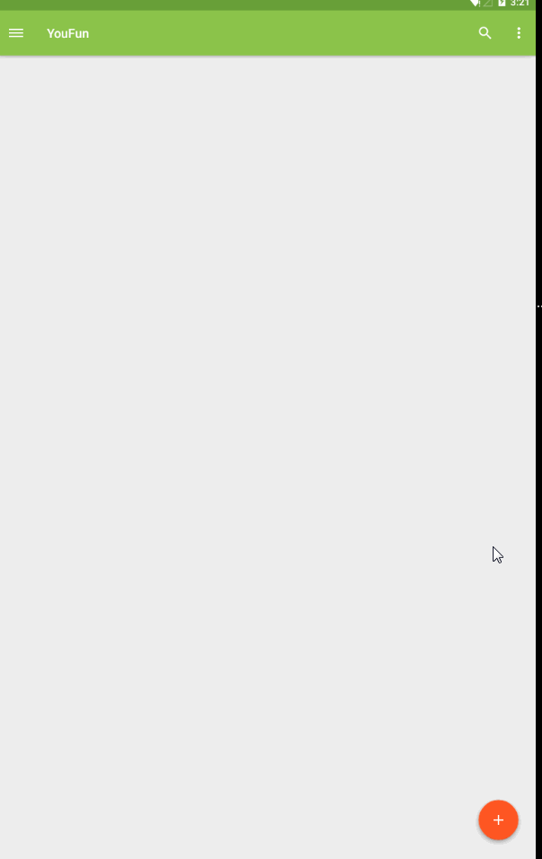

# YouFun
A App just for practise using cube-sdk and Android L.

##Current work
  

##Thanks
clog, version: 1.0.2, https://github.com/liaohuqiu/android-CLog 
cube-sdk, version: 1.0.44.13-SNAPSHOT, https://github.com/etao-open-source/cube-sdk 
ultra-pull-to-refresh, version: 1.0.8.1-SNAPSHOT, https://github.com/liaohuqiu/android-Ultra-Pull-To-Refresh 
eventbus, version: 2.4.0, https://github.com/greenrobot/EventBus 
android-floating-action-button, version: 1.8.0, https://github.com/futuresimple/android-floating-action-button 
